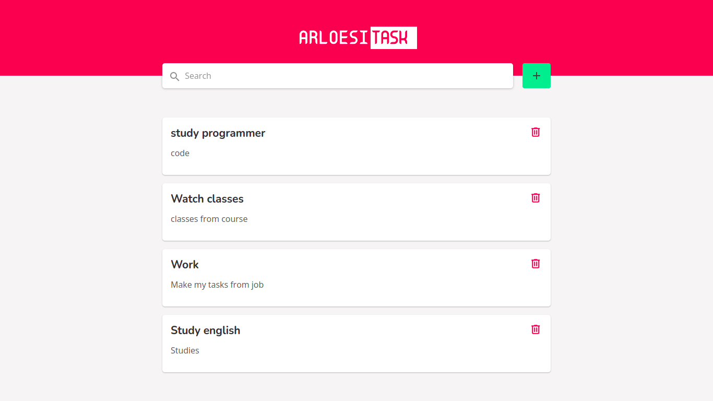
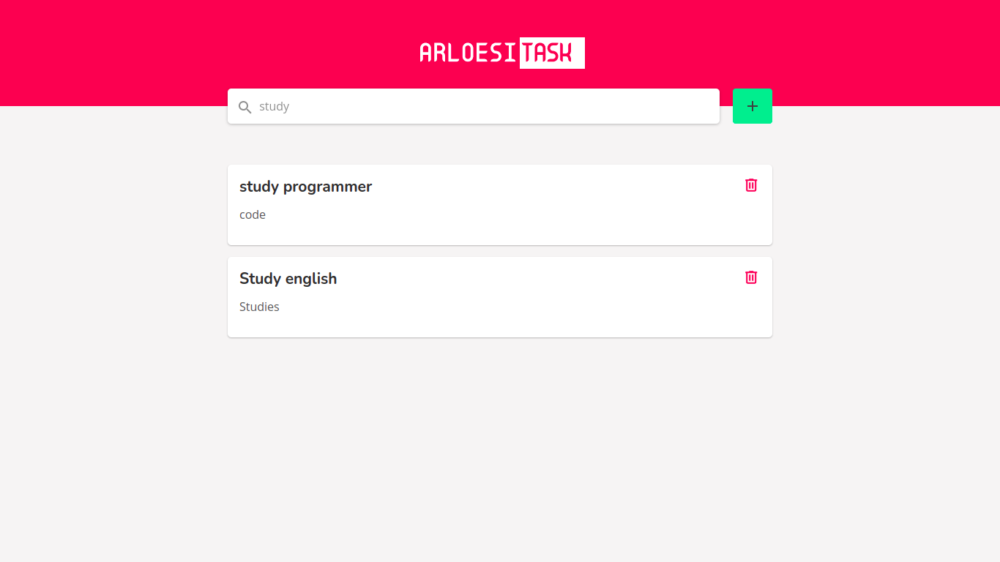
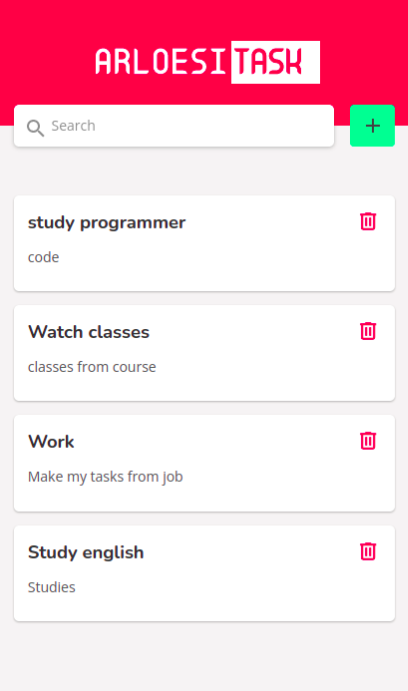
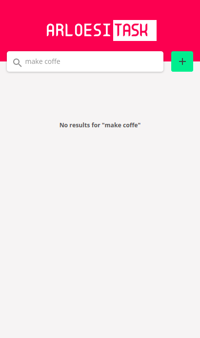

<h1 align="center">Arloesi Task</h1>

<p align="center">
  
  
  <a href="https://github.com/jtiagosantos/arloesi-task/commits/master">
    
  </a>
  
   <a href="https://github.com/jtiagosantos/arloesi-task/stargazers">
    
  </a>
</p>

<h4 align="center"> 
	🚧  Arloesi Task 📝 Completed 🚀 🚧
</h4>

<p align="center">
  <a href="#-features">Features</a> •
  <a href="#-run-project">Run Project</a> • 
  <a href="#-technologies">Technologies</a> • 
  <a href="#-layout">Layout</a> •
  <a href="#-deploy">Deploy</a> •
  <a href="#-author">Author</a> • 
  <a href="#-license">License</a>
</p>

<br>

<h2>Desktop</h2>

<h1 align="center">
    
</h1>

<h1 align="center">
    
</h1>

<h2>Mobile</h2>

<h1 align="center">
    
    
</h1>

<hr />

## ⚙️ Features

- [x] See tasks
- [x] Add new task
- [x] Remove task 
- [x] Filter tasks by search 
- [x] Responsive

<hr>

## 🚀 Run Project

1️⃣ Clone project and access its folder:

```bash
$ git clone https://github.com/jtiagosantos/arloesi-task.git
$ cd arloesi-task
```

2️⃣ Install dependencies:

```bash
$ yarn or npm i
```

3️⃣ Run tests:

```bash
$ yarn test or npm run test
```

4️⃣ Start project:

```bash
$ yarn dev or npm run dev
```

<hr>

## 🛠 Technologies

The following tools were used in the construction of project:

- **[React](https://reactjs.org/docs/getting-started.html)**
- **[Vite](https://vitejs.dev/)**
- **[Typescript](https://www.typescriptlang.org/)**
- **[Styled Components](https://styled-components.com/)**
- **[React Toastify](https://fkhadra.github.io/react-toastify/introduction)**
- **[Jest](https://jestjs.io/pt-BR/)**
- **[React Testing Library](https://testing-library.com/)**
- **[SWC](https://swc.rs/)**
- **[ESLint](https://eslint.org/)**
- **[Prettier](https://prettier.io/)**

<hr>

## 🔖 Layout

You can view the project layout through the link below:

- **[Layout Web](https://www.figma.com/file/gv4YsR5eNzUqWpzOmnJbX9/Arloesi-Task?node-id=0%3A1)**

<hr>

## :cloud: Deploy

- **[Arloesi Task](https://arloesi-task-85ccgyhil-jtiagosantos.vercel.app/)**

<hr>

## 👨‍💻 Author


<strong><a href="https://github.com/jtiagosantos">Tiago Santos </a>🚀</strong>

[](https://www.linkedin.com/in/josetiagosantosdelima/)
[](mailto:tiago.santos@icomp.ufam.edu.br)

<hr>

## 📝 License

This project is under license [MIT](./LICENSE).
